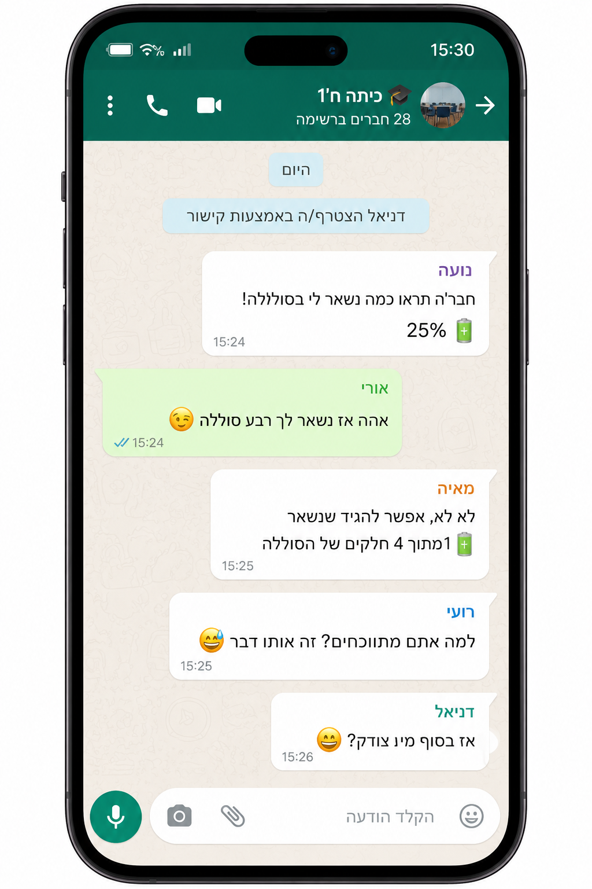

# שקף 3

**תבנית:** SingleChoiceQuestionImage

## הנחיות הפקה (מתוך הערות השקף)

- שם המסך בפיגמה:SingleChoiceQuestionImage
- משוב עולה אחרי ניסיון ראשון.
- כפתור המשך זמין ללחיצה אחרי מענה על השאלה.
- לעצב תמונה בהתאם לרפרנס

## תוכן השקף

- חזרה
- אחים בלב
- ס
- אושר
- לי יש רק 25% סוללה
- לי יש רק רבע סוללה
- גל
- לי נשארו רק 0.25 מהסוללה
- אושר, עדן וגל הם שלושה אחים שיצאו למחנה של הצופים.
- לאורך היום, סוללות הטלפונים שלהם התרוקנו, אבל היה להם רק מטען אחד משותף.
- הם החליטו שמי שישתמש ראשון במטען הוא זה שהסוללה שלו היא החלשה ביותר.
- הסתכלו בהתכתבות בטלפון של עדן. מי מהם צריך להשתמש ראשון במטען?
- סמנו את התשובה המתאימה.
- אושר
- עדן
- גל
- הם צריכים לעשות הגרלה
- כל הכבוד! / זה לא מדוייק
- אין להם ברירה, הם צריכים לעשות הגרלה...
- צדקתי?

## תמונות רפרנס

