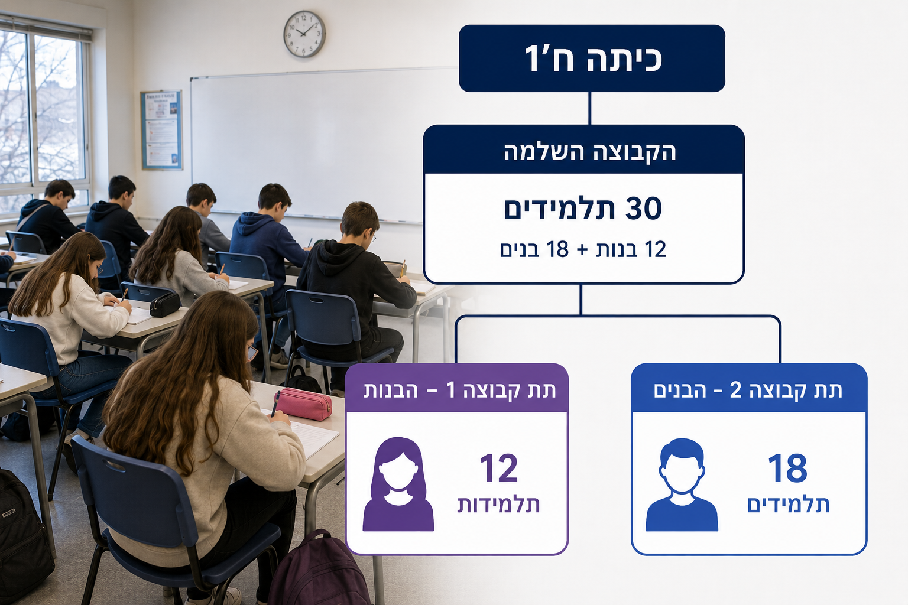

# שקף 8

**תבנית:** לא צוין

## הנחיות הפקה (מתוך הערות השקף)

- ההקנייה תתבצע בתוך גלילה
- כפתור המשך יהיה זמין ללחיצה בתחתית הגלילה לאחר מענה על כל השאלות
- צורך בעיצוב הטבלה עם הנתונים בפנים
- תמונה בתיקיית אלמנטים

## תוכן השקף

- היחס בין מספר הבנות למספר התלמידים בכיתה הוא 12:30 אותו נצמצם ל- 5 : 2 .
- היחס בין מספר הבנים למספר התלמידים בכיתה הוא 18:30 אותו נצמצם ל- 5 : 3 .
- אלו הם היחסים בין מספר התלמידים בקבוצה החלקית (מספר הבנים / הבנות) לבין מספר התלמידים בקבוצה השלמה (מספר התלמידים בכיתה).
- המשך

## תמונות רפרנס

