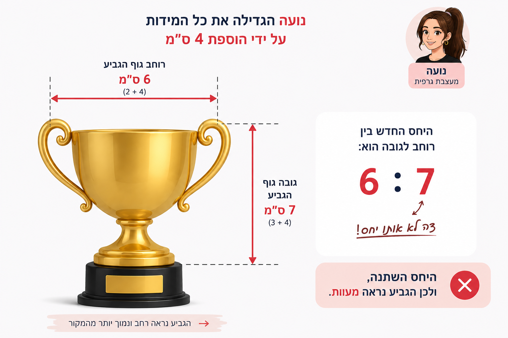
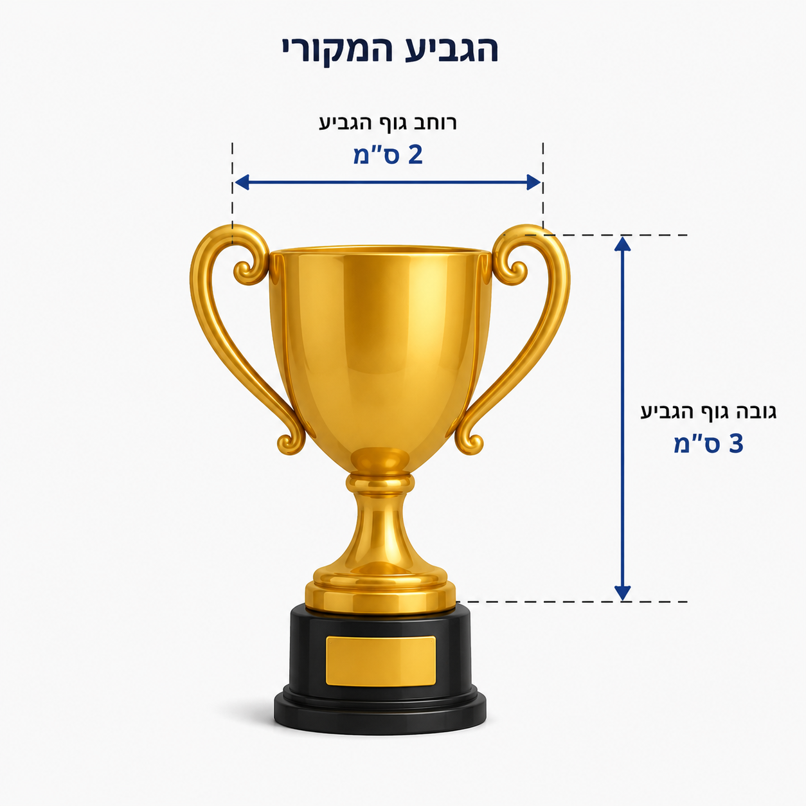

# שקף 11

**תבנית:** SingleChoiceQuestionImage

## הנחיות הפקה (מתוך הערות השקף)

- ההקנייה תתבצע בתוך גלילה
- כפתור המשך יהיה זמין ללחיצה בתחתית הגלילה לאחר מענה על כל השאלות
- שם המסך בפיגמה:SingleChoiceQuestionImage
- ניסיון אחד למענה, משוב עולה מיד אח"כ
- תמונה בתיקיית תמונות

## תוכן השקף

- המשך
- חזרה
- היחס בין רוחב גביע האליפות האמיתי לגובהו הוא 3 : 2 .
- איתי הוסיף 4 ס"מ לרוחב ולגובה של הגביע האמיתי, כך:
- 6 ס"מ = 4 ס"מ + 2 ס"מ
- 7 ס"מ = 4 ס"מ + 3 ס"מ
- היחס בין הרוחב לגובה של הגביע של איתי הוא 7 : 6 .
- האם היחס בין הרוחב לגובה של  הגביע האמיתי (3 : 2) נשמר?
- כן
- לא
- הגביע האמיתי
- הגביע של איתי
- כל הכבוד! / זה לא מדויק
- היחס של הגביע האמיתי לא נשמר, תיכף נבין למה.
- צדקתי?

## תמונות רפרנס

