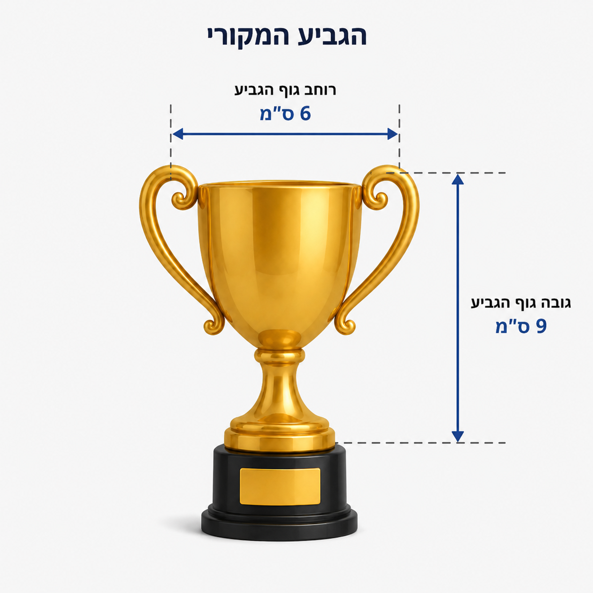

# שקף 12

**תבנית:** SingleChoiceQuestionImage

## הנחיות הפקה (מתוך הערות השקף)

- ההקנייה תתבצע בתוך גלילה
- כפתור המשך יהיה זמין ללחיצה בתחתית הגלילה לאחר מענה על כל השאלות
- שם המסך בפיגמה:SingleChoiceQuestionImage
- ניסיון אחד למענה, משוב עולה מיד אח"כ
- תמונה בתיקיית תמונות

## תוכן השקף

- המשך
- חזרה
- נועה הכפילה פי 3 את מידת הרוחב ואת מידת הגובה של הגביע האמיתי, כך:
- 6 ס"מ =  3 · 2 ס"מ
- 9 ס"מ =  3 · 3 ס"מ
- היחס בין הרוחב לגובה של הגביע של נועה הוא 9 : 6 .
- האם היחס של הגביע האמיתי (3 : 2) נשמר?
- כן
- לא
- הגביע האמיתי
- הגביע של נועה
- כל הכבוד! / זה לא מדוייק
- היחס של הגביע האמיתי נשמר, תיכף נבין למה.

## תמונות רפרנס

