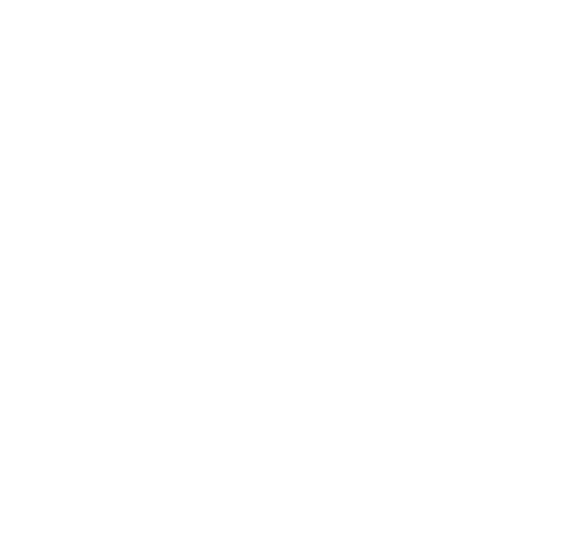

# שקף 22

**תבנית:** Guided

## הנחיות הפקה (מתוך הערות השקף)

- שם המסך בפיגמה: Guided Instruction

## תוכן השקף

- התבוננו בתרגיל הבא. אל תפתרו אותו, רק הסתכלו על הנתונים וחישבו האם יש לכם כיוון לפתרון.
- 5 ס"מ
- לא
- כן
- משקל הציפוי כולו הוא 225 גרם (225 = 200 + 25).
- משקל אבקת הסוכר הוא 25 גרם.
- היחס בין משקל אבקת הסוכר למשקל הציפוי כולו הוא 225 : 25,
- ואם נצמצם את היחס ב-25 נקבל יחס 9 :  1 שבהצגת שבר הוא    . לכן, הטענה נכונה.

## תמונות רפרנס

