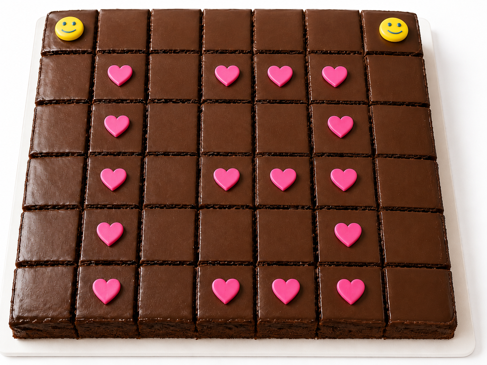
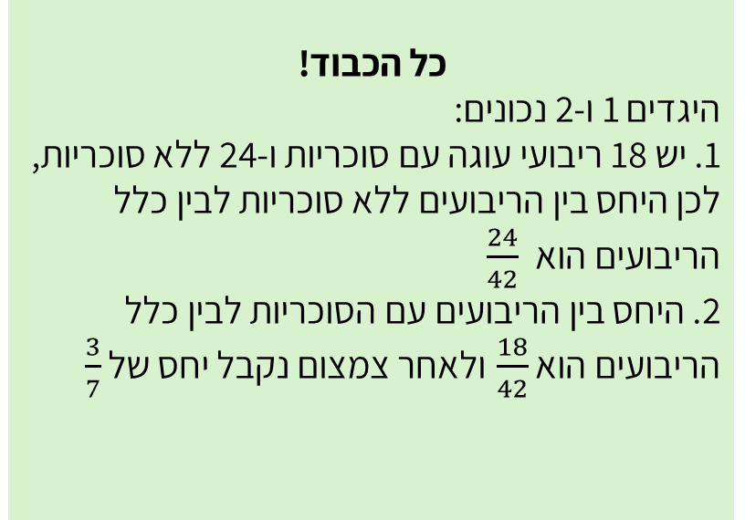
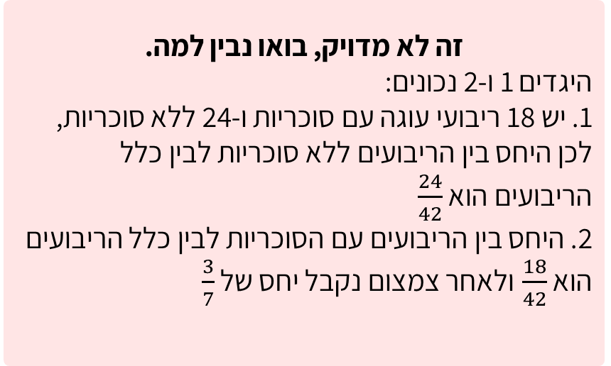

# שקף 27

**תבנית:** StatementAssessmentQuestion

## הנחיות הפקה (מתוך הערות השקף)

- תרגול סטנדרטי א שאלה 1 סעיף א מתוך 4
- שם המסך בפיגמה:StatementAssessmentQuestion
- תמונה בתיקיית תמונות

## תוכן השקף

- צדקתי?
- תאיר חוגגת יום הולדת 13. היא הכינה עוגת שוקולד וחילקה אותה ל-42 ריבועים שווי שטח. על 16 ריבועים היא שמה סוכריות בצורת לב ועל 2 ריבועים היא שמה סוכריות בצורת סמיילי.
- א. לגבי כל היגד, סמנו נכון או לא נכון:
- אפשר רמז?
- נכון
- לא נכון
- נכון
- לא נכון
- 3. מספר ריבועי העוגה ללא סוכריות גדול פי 4 ממספר ריבועי העוגה עם הסוכריות
- נכון
- לא נכון
- חזרה
- הקפידו על סדר כתיבת היחס.
- חזרה לשאלה
- אחרי טעות ראשונה:
- זה לא מדוייק, ננסה שוב?
- 1. היחס בין מספר ריבועי העוגה ללא הסוכריות לבין מספר כלל ריבועי העוגה הוא
- 2. מספר ריבועי העוגה עם הסוכריות הוא  מכלל ריבועי העוגה
- זה לא מדויק, בואו נבין למה.
- היגדים 1 ו-2 נכונים:
- 1. יש 18 ריבועי עוגה עם סוכריות ו-24 ללא סוכריות, לכן היחס בין הריבועים ללא סוכריות לבין כלל הריבועים הוא
- 2. היחס בין הריבועים עם הסוכריות לבין כלל הריבועים הוא  ולאחר צמצום נקבל יחס של
- כל הכבוד!
- היגדים 1 ו-2 נכונים:
- 1. יש 18 ריבועי עוגה עם סוכריות ו-24 ללא סוכריות, לכן היחס בין הריבועים ללא סוכריות לבין כלל הריבועים הוא
- 2. היחס בין הריבועים עם הסוכריות לבין כלל הריבועים הוא  ולאחר צמצום נקבל יחס של

## תמונות רפרנס

