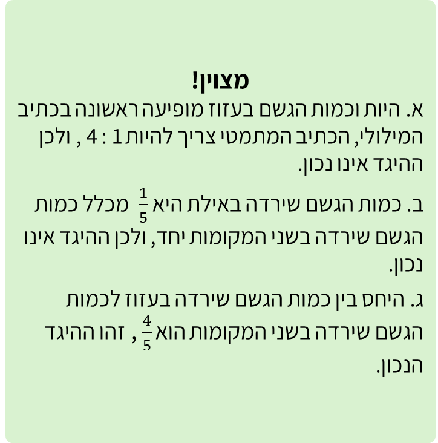

# שקף 29

**תבנית:** SingleChoiceQuestionImage

## הנחיות הפקה (מתוך הערות השקף)

- תרגול סטנדרטי א שאלה 2 מתוך 4
- שם המסך בפיגמה:SingleChoiceQuestionImage

## תוכן השקף

- צדקתי?
- כמות הגשם שירדה בעזוז בחורף 2026 הייתה גדולה פי 4 מכמות הגשם שירדה באילת.
- סמנו את ההיגד הנכון:
- א. היחס בין כמות הגשם שירדה בעזוז לבין כמות הגשם שירדה באילת הוא 4 : 1
- אפשר רמז?
- חזרה
- הקפידו לרשום את הכמויות במיקום הנכון בביטויים המייצגים יחס.
- חזרה לשאלה
- אחרי טעות ראשונה:
- זה לא מדוייק, ננסה שוב?

## תמונות רפרנס

