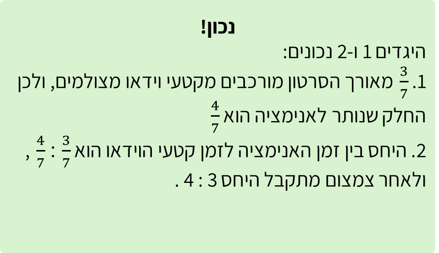
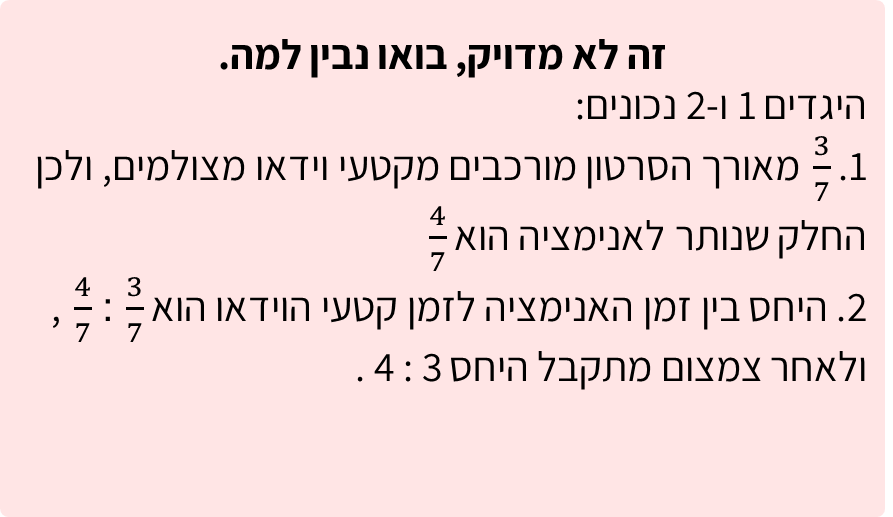

# שקף 30

**תבנית:** MultipleChoiceQuestion

## הנחיות הפקה (מתוך הערות השקף)

- תרגול סטנדרטי א שאלה 3 מתוך 4
- שם המסך בפיגמה: MultipleChoiceQuestion
- תמונה בתיקיית תמונות

## תוכן השקף

- צדקתי?
- אפשר רמז?
- חזרה
- רמת חשיבה
- טקסט
- טקסט
- בדקו מהו החלק של כל סוג תוכן מתוך הסרטון.
- חזרה לשאלה
- היחס בין זמן האנימציה הממוחשבת לבין זמן קטעי הוידאו המצולמים בסרטון הוא 3 : 4
- בסרטון של אור יש יותר זמן של וידאו מצולם מאשר זמן של אנימציה ממוחשבת
- אחרי טעות ראשונה:
- זה לא מדוייק, ננסה שוב?
- זה לא מדויק, בואו נבין למה.
- היגדים 1 ו-2 נכונים:
- 1.  מאורך הסרטון מורכבים מקטעי וידאו מצולמים, ולכן החלק שנותר לאנימציה הוא
- 2. היחס בין זמן האנימציה לזמן קטעי הוידאו הוא  :  , ולאחר צמצום מתקבל היחס 3 : 4 .
- נכון!
- היגדים 1 ו-2 נכונים:
- 1.  מאורך הסרטון מורכבים מקטעי וידאו מצולמים, ולכן החלק שנותר לאנימציה הוא
- 2. היחס בין זמן האנימציה לזמן קטעי הוידאו הוא  :  , ולאחר צמצום מתקבל היחס 3 : 4 .

## תמונות רפרנס

