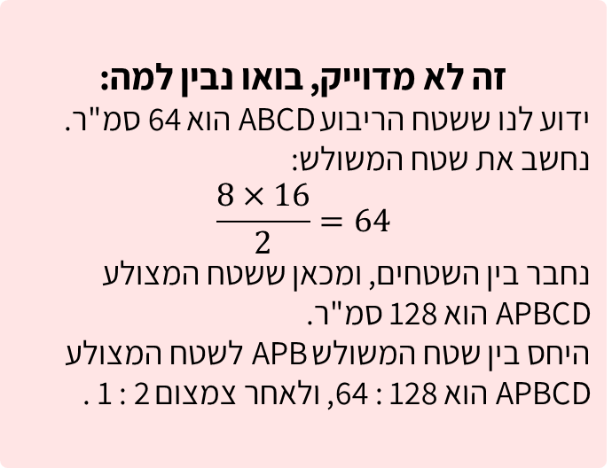
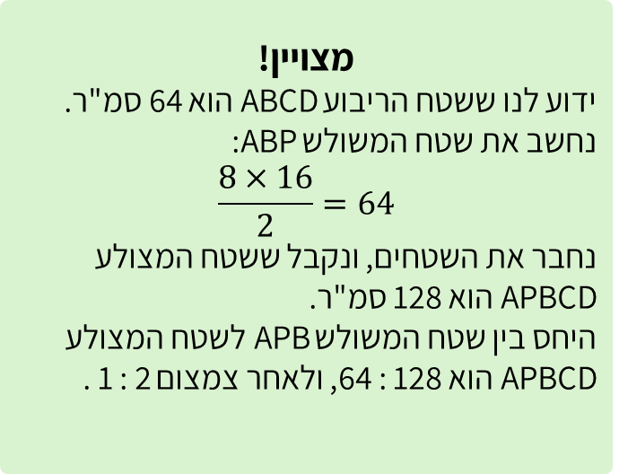

# שקף 32

**תבנית:** ValueInputQuestion

## הנחיות הפקה (מתוך הערות השקף)

- תרגול סטנדרטי א שאלה 4 סעיף ב מתוך 4
- שם המסך בפיגמה:ValueInputQuestion
- עיצוב: סרטוט בהתאם מדוייק לפרופורציות של הסרטוט בשקף

## תוכן השקף

- שטחו של ריבוע ABCD הוא 64 סמ"ר.
- היחס בין צלע הריבוע לבין גובה המשולש (PE)הוא 2 : 1 .
- ב. מהו היחס המצומצם בין שטח משולשAPB  לבין שטח המצולע APBCD?
- הקלידו את התשובה.
- צדקתי?
- חזרה
- כדי לחשב את שטח המצולעAPBCD  נחשב את השטח של כל אחת מהצורות המרכיבות אותו ונחבר את השטחים.
- חזרה לשאלה
- אפשר רמז?
- A
- B
- C
- D
- P
- E
- התשובה הנכונה היא 2 : 1
- אחרי טעות ראשונה:
- זה לא מדוייק, ננסה שוב?
- :

## תמונות רפרנס

