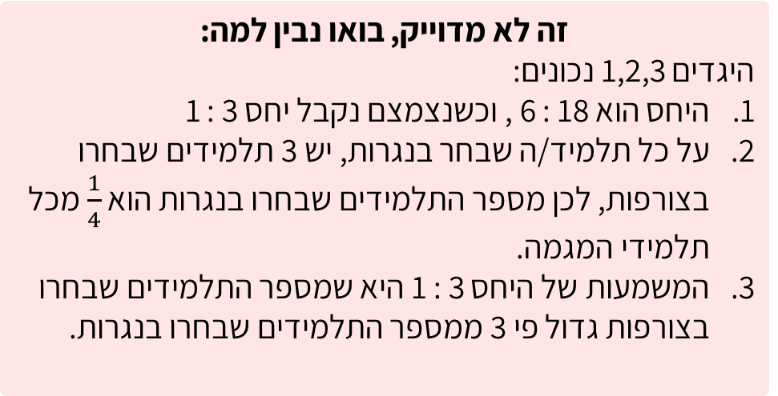
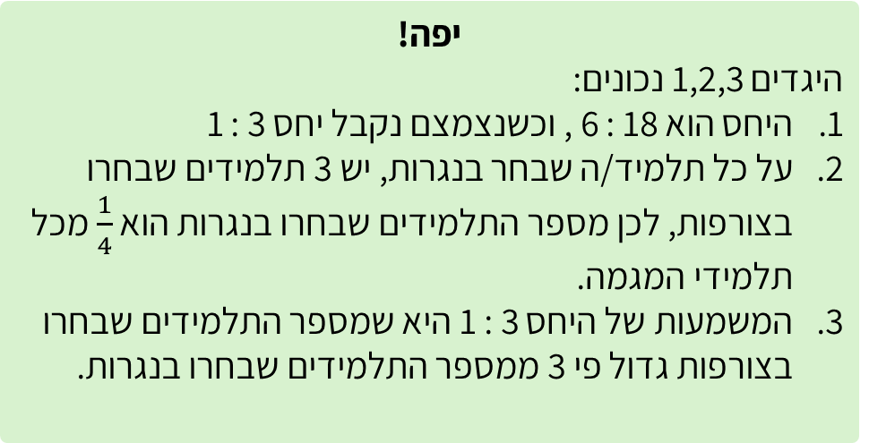

# שקף 34

**תבנית:** MultipleChoiceQuestion

## הנחיות הפקה (מתוך הערות השקף)

- תרגול בסיסי שאלה 1 מתוך 3
- שם המסך בפיגמה: MultipleChoiceQuestion

## תוכן השקף

- צדקתי?
- במגמת אומנות יש 24 תלמידים.
- במסגרת יום סדנאות מיוחד, 6 מהם בחרו בסדנת נגרות והשאר בחרו בסדנת צורפות. סמנו את כל ההיגדים הנכונים:
- אפשר רמז?
- חזרה
- הבחינו בין שני מקרים: היחס בין מספר התלמידים שבחרו בנגרות לבין מספר התלמידים שבחרו בצורפות, או היחס בין קבוצת התלמידים שבחרו בנגרות/צורפות לבין כלל התלמידים במגמת האומנות.
- חזרה לשאלה
- אחרי טעות ראשונה:
- זה לא מדוייק, ננסה שוב?
- היחס בין מספר משתתפי סדנת הנגרות למספר משתתפי סדנת הצורפות הוא 3 : 1
- מספר משתתפי סדנת הצורפות גדול פי 3 ממספר משתתפי סדנת הנגרות
- אם יצטרף תלמיד אחד לכל סדנה, היחס בין מספר משתתפי סדנת הצורפות למספר משתתפי סדנת הנגרות יישמר
- יפה!
- היגדים 1,2,3 נכונים:
- היחס הוא 18 : 6 , וכשנצמצם נקבל יחס 3 : 1
- על כל תלמיד/ה שבחר בנגרות, יש 3 תלמידים שבחרו בצורפות, לכן מספר התלמידים שבחרו בנגרות הוא  מכל תלמידי המגמה.
- המשמעות של היחס 3 : 1 היא שמספר התלמידים שבחרו בצורפות גדול פי 3 ממספר התלמידים שבחרו בנגרות.
- זה לא מדוייק, בואו נבין למה:
- היגדים 1,2,3 נכונים:
- היחס הוא 18 : 6 , וכשנצמצם נקבל יחס 3 : 1
- על כל תלמיד/ה שבחר בנגרות, יש 3 תלמידים שבחרו בצורפות, לכן מספר התלמידים שבחרו בנגרות הוא  מכל תלמידי המגמה.
- המשמעות של היחס 3 : 1 היא שמספר התלמידים שבחרו בצורפות גדול פי 3 ממספר התלמידים שבחרו בנגרות.

## תמונות רפרנס

