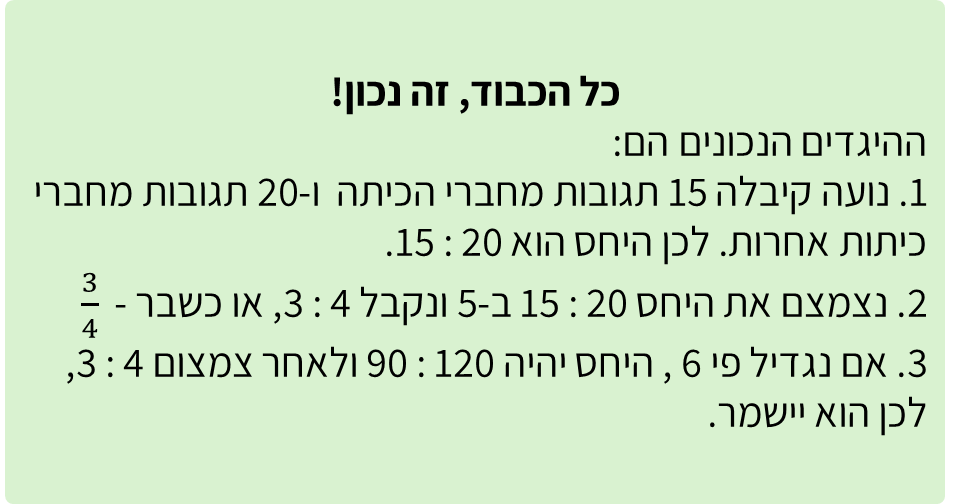
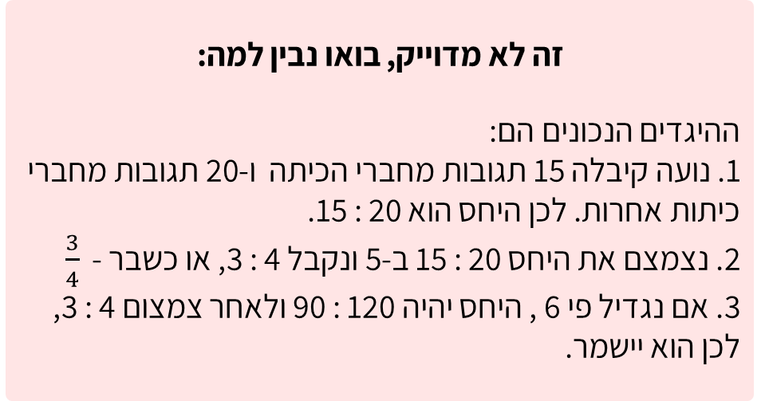

# שקף 35

**תבנית:** MultipleChoiceQuestion

## הנחיות הפקה (מתוך הערות השקף)

- תרגול בסיסי שאלה 2 מתוך 3
- שם המסך בפיגמה: MultipleChoiceQuestion
- תמונה בתיקיית תמונות

## תוכן השקף

- צדקתי?
- נועה העלתה סרטון קצר לאינסטגרם וקיבלה עליו 35 תגובות סך הכול.
- 15 מהתגובות היו מחברים מהכיתה, והשאר היו מחברים מכיתות אחרות.
- בחרו את ההיגדים הנכונים:
- אפשר רמז?
- חזרה
- חשבו כמה תגובות היו מחברי הכיתה וכמה מכיתות אחרות.
- חזרה לשאלה
- אחרי טעות ראשונה:
- זה לא מדוייק, ננסה שוב?
- 1. היחס בין מספר התגובות מחברי הכיתה לבין מספר התגובות מחברי הכיתות האחרות הוא 20 : 15
- 4. אם מספר התגובות מחברי הכיתה וגם מספר התגובות מחברי הכיתות האחרות יגדלו פי פי 6, היחס ביניהם ישאר 4 : 3

## תמונות רפרנס

