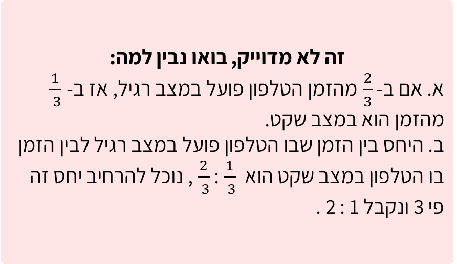
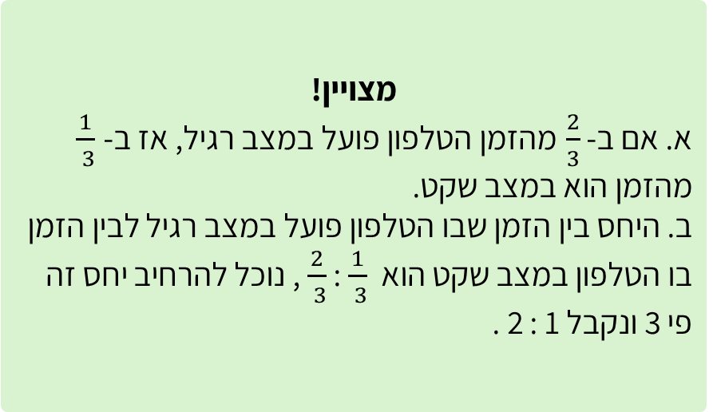
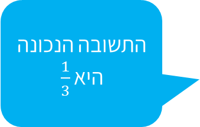

# שקף 36

**תבנית:** ValueInputQuestion

## הנחיות הפקה (מתוך הערות השקף)

- תרגול בסיסי שאלה 3 מתוך 3
- שם המסך בפיגמה:ValueInputQuestion

## תוכן השקף

- צדקתי?
- אפשר רמז?
- חזרה
- א. באיזה חלק מהזמן הטלפון פועל במצב שקט?
- ב. מה היחס בין הזמן שבו הטלפון פועל במצב רגיל לבין הזמן שהוא עובד במצב שקט?
- אחרי טעות ראשונה:
- זה לא מדוייק, ננסה שוב?
- :
- התשובה הנכונה היא 1 : 2
- איזה חלק מהיממה הטלפון במצב שקט?
- חזרה לשאלה
- מצויין!
- א. אם ב-  מהזמן הטלפון פועל במצב רגיל, אז ב-
- מהזמן הוא במצב שקט.
- ב. היחס בין הזמן שבו הטלפון פועל במצב רגיל לבין הזמן בו הטלפון במצב שקט הוא  :  , נוכל להרחיב יחס זה פי 3 ונקבל 1 : 2 .
- זה לא מדוייק, בואו נבין למה:
- א. אם ב-  מהזמן הטלפון פועל במצב רגיל, אז ב-
- מהזמן הוא במצב שקט.
- ב. היחס בין הזמן שבו הטלפון פועל במצב רגיל לבין הזמן בו הטלפון במצב שקט הוא  :  , נוכל להרחיב יחס זה פי 3 ונקבל 1 : 2 .

## תמונות רפרנס

