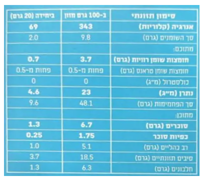

# שקף 39

**תבנית:** StatementAssessmentQuestion

## הנחיות הפקה (מתוך הערות השקף)

- תרגול סטנדרטי ב שאלה 1סעיף ב מתוך 2
- שם המסך בפיגמה:StatementAssessmentQuestion
- עיצוב על פי הרפרנס, כולל התיקון שעליו

## תוכן השקף

- צדקתי?
- אפשר רמז?
- חזרה
- זו תשובה נכונה מאוד!
- היגדים 2 ו-3 נכונים:
- משקל הפחמימות הוא 10 גרם ומשקל השומן הוא 2 גרם, לכן משקל הפחמימות גדול פי 5 ממשקל השומן.
- היחס בין משקל הסוכרים ב-100 גרם לבין משקל הסוכרים ב-20 גרם הוא 1.3 : 6.7, ולאחר צמצום מתקבל בערך היחס 1 : 5.
- ב-100 גרם יש23  מ"ג נתרן, לכן ב-150 גרם יש 34.5 מ"ג (פי 1.5).
- בדקו בכל היגד אם הכמות המצוינת מתאימה לנתונים שעל התווית.
- חזרה לשאלה
- הנה תווית הערכים המלאה של החטיף.
- ב. סמנו נכון/ לא נכון ליד כל היגד:
- 1. משקל הפחמימות ביחידה אחת גדול פי 2 ממשקל השומן
- נכון
- לא נכון
- 2. היחס בין משקל הסוכרים ב-100 גרם חטיף לבין משקל הסוכרים ב-20 גרם חטיף הוא בערך1 : 5  .
- נכון
- לא נכון
- 3. משקל הנתרן ב-150 גרם חטיף הוא 34.5 גרם
- נכון
- לא נכון
- 10
- זה לא מדוייק, בואו נבין למה:
- היגדים 2 ו-3 נכונים:
- משקל הפחמימות הוא 10 גרם ומשקל השומן הוא 2 גרם, לכן משקל הפחמימות גדול פי 5 ממשקל השומן
- היחס בין משקל הסוכרים ב-100 גרם לבין משקל הסוכרים ב-20 גרם הוא 1.3 : 6.7, ולאחר צמצום מתקבל בערך היחס 1 : .5
- ב-100 גרם יש 23 מ"ג נתרן, לכן ב-150 גרם יש 34.5 מ"ג (פי 1.5).
- אחרי טעות ראשונה:
- זה לא מדוייק, ננסה שוב?

## תמונות רפרנס

