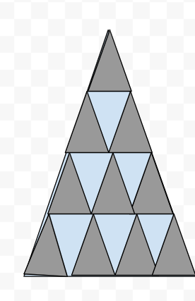

# שקף 40

**תבנית:** ValueInputQuestion

## הנחיות הפקה (מתוך הערות השקף)

- תרגול סטנדרטי ב שאלה 2 סעיף א מתוך 2
- שם המסך בפיגמה:ValueInputQuestion
- עיצוב בהתאם לרפרנס, חשוב להשתמש באותם צבעים ולהקפיד על זה שכל המשולשים הקטנים בשני הצבעים צריכים להיות זהים אחד לשני

## תוכן השקף

- המשולש שלפניכם מחולק למשולשים קטנים זהים זה לזה, וצבועים באפור ותכלת.
- א. השלימו את היחסים:
- 1. מהו היחס בין השטח האפור לשטח התכלת?
- 2. מהו היחס בין השטח האפור לשטח המשולש הגדול?
- צדקתי?
- אפשר רמז?
- חזרה
- תשובה נכונה!
- כל המשולשים זהים ולכן הם שווי שטח.
- יש 10 משולשים אפורים ו-6 משולשים בצבע תכלת.
- לכן היחס בין השטח האפור לשטח התכלת
- הוא 6 : 10 ואם נצמצם נקבל 3 : 5
- 2.  יש 10 משולשים אפורים ו-16 משולשים סה"כ במשולש הגדול. היחס בין השטח האפור לשטח המשולש הגדול הוא 16 : 10 ואם נצמצם נקבל 8 : 5
- אין צורך לחשב את השטחים כדי למצוא את היחסים המבוקשים בשאלה.
- חזרה לשאלה
- התשובות הנכונות הן:
- 3 : 5
- 8 : 5
- :
- :
- זה לא מדוייק, בואו נבין למה:
- 1. כל המשולשים זהים ולכן הם שווי שטח. יש 10 משולשים אפורים ו-6 משולשים בצבע תכלת. לכן היחס בין השטח האפור לשטח התכלת הוא 6 : 10 ואם נצמצם נקבל 3 : 5
- 2.  יש 10 משולשים אפורים ו-16 משולשים סה"כ במשולש הגדול. היחס בין השטח האפור לשטח המשולש הגדול הוא 16 : 10 ואם נצמצם נקבל 8 : 5
- אחרי טעות ראשונה:
- זה לא מדוייק, ננסה שוב?

## תמונות רפרנס

