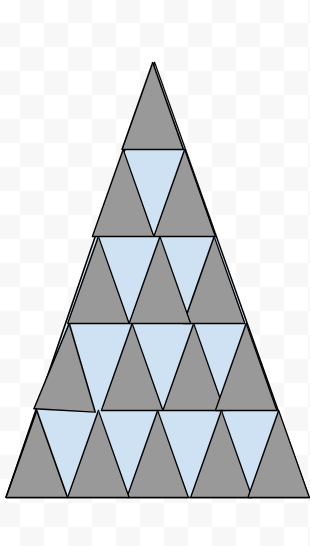

# שקף 41

**תבנית:** StatementAssessmentQuestion

## הנחיות הפקה (מתוך הערות השקף)

- תרגול סטנדרטי ב שאלה 2 סעיף ב מתוך 2
- שם המסך בפיגמה:StatementAssessmentQuestion
- עיצוב בהתאם לרפרנס, כל המשולשים הקטנים זהים

## תוכן השקף

- צדקתי?
- אפשר רמז?
- חזרה
- כל הכבוד!
- 1.  היחס בין השטח האפור לבין השטח בצבע תכלת לאחר ההוספה של המשולשים הוא 10 : 15 . אם נצמצם ב- 5 נקבל שהיחס הוא 2 : 3 ולכן היחס לא נשמר.
- 2.  הכפלנו פי אותו מספר את כמות המשולשים האפורים ואת כמות המשולשים בצבע תכלת, לכן היחס נשמר.
- רמז: בדקו בכל סעיף איזה שינוי בוצע על כמות המשולשים מכל סוג.
- האם השינוי שומר / לא שומר על היחס?
- חזרה לשאלה
- ב. באילו מהמקרים היחס בין השטח האפור לבין השטח בצבע תכלת נשמר (נזכיר, היחס הוא 3 : 5)?
- הוסיפו עוד 5 משולשים אפורים זהים ו- 4 משולשים זהים בצבע תכלת
- כך שהתקבל המשולש המתואר בסרטוט.
- 2. מספר המשולשים האפורים ומספר המשולשים בצבע תכלת יגדל פי 4.
- היחס נשמר
- היחס לא נשמר
- היחס נשמר
- היחס לא נשמר
- זה לא מדוייק, בואו נבין למה:
- 1.  היחס בין השטח האפור לבין השטח בצבע תכלת לאחר ההוספה של המשולשים הוא 10 : 15 . אם נצמצם ב- 5 נקבל שהיחס הוא 2 : 3 ולכן היחס לא נשמר.
- 2.  הכפלנו פי אותו מספר את כמות המשולשים האפורים ואת כמות המשולשים בצבע תכלת, לכן היחס נשמר.
- אחרי טעות ראשונה:
- זה לא מדוייק, ננסה שוב?

## תמונות רפרנס

