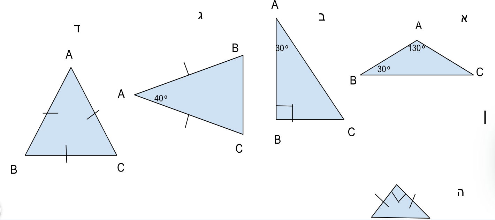

# שקף 43

**תבנית:** ValueInputQuestion

## הנחיות הפקה (מתוך הערות השקף)

- תרגול מתקדם שאלה 1 סעיף א מתוך 3
- שם המסך בפיגמה:ValueInputQuestion
- עיצוב סרטוט במדוייק בהתאם לרפרנס
- המשולש עם החלון הריק וסימן המעלות יופיע קודם. הלומדים יקלידו את התשובה.
- התשובה הנכונה היא
- רק אח"כ יופיעו חלונות למילוי היחס. התשובות הנכונות הן 13 : 3 : 2
- תרגול מתקדם שאלה 1 סעיף א מתוך 3
- שם המסך בפיגמה:ValueInputQuestion
- עיצוב סרטוט במדוייק בהתאם לרפרנס
- המשולש עם החלון הריק וסימן המעלות יופיע קודם. הלומדים יקלידו את התשובה.
- התשובה הנכונה היא 20°
- רק אח"כ יופיעו חלונות למילוי היחס. התשובות הנכונות הן 13 : 3 : 2

## תוכן השקף

- צדקתי?
- אפשר רמז?
- חזרה
- חזרה לשאלה
- א. לפניכם משולש ABC שבו נתונים גודלן של חלק מהזוויות שלו.
- השלימו את גודל הזווית החסרה.
- רשמו את היחס המצומצם בין הגדלים של שלושת הזוויות במשולש (התחילו משמאל, מהזווית הקטנה ביותר)
- °
- זכרו: סכום הזוויות במשולש הוא °180
- :
- :
- זה מדוייק!
- סכום הזוויות במשולש הוא °180 .
- נחשב את הזווית השלישית במשולש:
- 20°1 = °30 – °130 - °180היחס בין שלושת הזוויות הוא 130 : 30 : 20 .
- לאחר צמצום היחס ב-10 ונקבל 13 : 3 : 2
- זה לא מדוייק, בואו נבין למה:
- סכום הזוויות במשולש הוא °180 .
- נחשב את הזווית השלישית במשולש:
- 20°1 = °30 – °130 - °180היחס בין שלושת הזוויות הוא 130 : 30 : 20 .
- לאחר צמצום היחס ב-10 ונקבל 13 : 3 : 2
- אחרי טעות ראשונה:
- זה לא מדוייק, ננסה שוב?

## תמונות רפרנס

