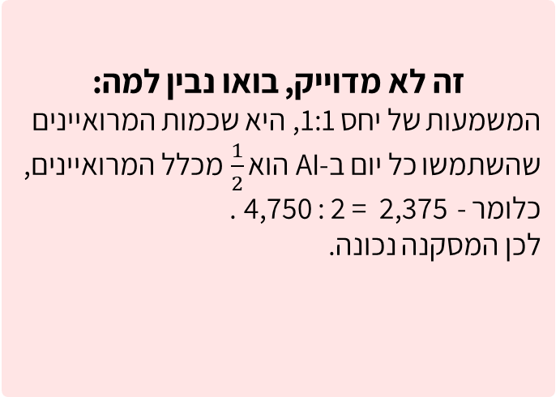
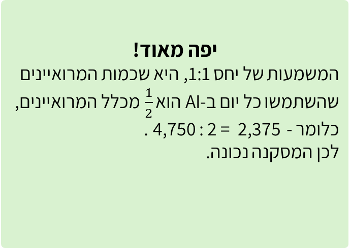

# שקף 45

**תבנית:** CUSTOM (לא בתבנית)

## הנחיות הפקה (מתוך הערות השקף)

- תרגול מתקדם שאלה 2 מתוך 3
- שקף לא בתבנית. שורה ראשונה בטבלה מופיעה, הלומד יסמן נכון / לא נכון.
- עיצוב טבלה

## תוכן השקף

- המסקנה אינה נכונה
- המסקנה נכונה
- מסקנה
- תוצאת המחקר
- 2,375  מהמרואיינים השתמשו
- ב-AI כל יום
- היחס בין מספר המרואיינים שהשתמשו כל יום ב-AI לאלו שלא השתמשו בו כל יום היה 1 : 1
- 1
- 2
- 3
- צדקתי?
- אפשר רמז?
- חזרה
- חישבו, מהי המשמעות של יחס 1 : 1?
- חזרה לשאלה
- במחקר שנערך בשנת 2025, נשאלו 4,750 מרואיינים לגבי מידת השימוש שלהם ב-AI.
- לפניכם חלק מתוצאות המחקר. סמנו ליד כל מסקנה אם היא נכונה או לא.

## תמונות רפרנס

