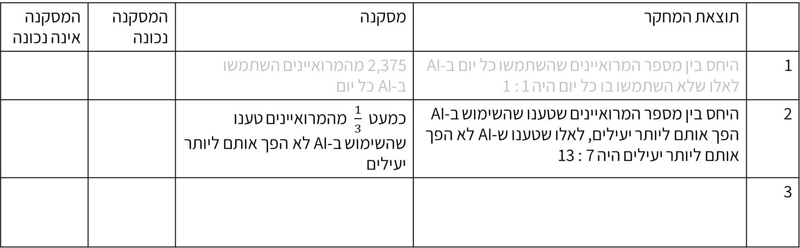
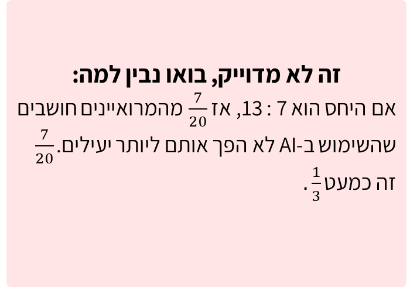
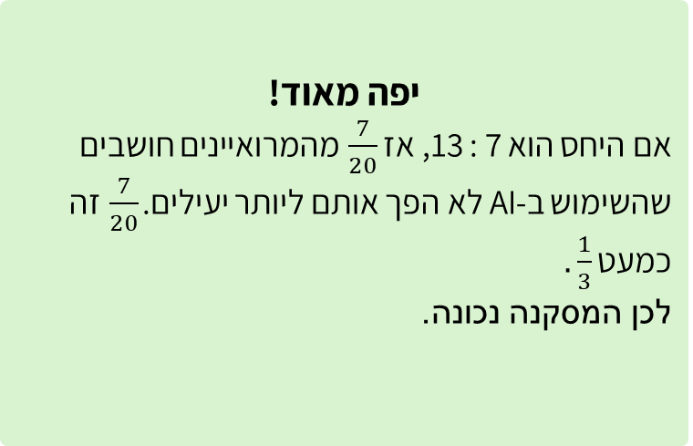

# שקף 46

**תבנית:** CUSTOM (לא בתבנית)

## הנחיות הפקה (מתוך הערות השקף)

- תרגול מתקדם שאלה 2 מתוך 3
- שקף לא בתבנית. שורה שנייה בטבלה מופיעה, הלומד יסמן נכון / לא נכון. השורה הראשונה תשאר אבל תהיה מואפרת.
- עיצוב טבלה

## תוכן השקף

- המסקנה אינה נכונה
- המסקנה נכונה
- מסקנה
- תוצאת המחקר
- 2,375 מהמרואיינים השתמשו
- ב-AI כל יום
- היחס בין מספר המרואיינים שהשתמשו כל יום ב-AI לאלו שלא השתמשו בו כל יום היה 1 : 1
- 1
- כמעט    מהמרואיינים טענו שהשימוש ב-AI לא הפך אותם ליותר יעילים
- היחס בין מספר המרואיינים שטענו שהשימוש ב-AI הפך אותם ליותר יעילים, לאלו שטענו ש-AI לא הפך אותם ליותר יעילים היה 7 : 13
- 2
- 3
- המסקנה אינה נכונה
- המסקנה נכונה
- מסקנה
- תוצאת המחקר
- 2,375 מהמרואיינים השתמשו
- ב-AI כל יום
- היחס בין מספר המרואיינים שהשתמשו כל יום ב-AI לאלו שלא השתמשו בו כל יום היה 1 : 1
- 1
- היחס בין מספר המרואיינים שטענו שהשימוש ב-AI הפך אותם ליותר יעילים, לאלו שטענו ש-AI לא הפך אותם ליותר יעילים היה 7 : 13
- 2
- 3
- צדקתי?
- אפשר רמז?
- חזרה
- חישבו: מה מתאר היחס בתוצאה זו של המחקר?
- חזרה לשאלה
- במחקר שנערך בשנת 2025, נשאלו 4,750 מרואיינים לגבי מידת השימוש שלהם ב-AI.
- לפניכם חלק מתוצאות המחקר. סמנו ליד כל מסקנה אם היא נכונה או לא.

## תמונות רפרנס

