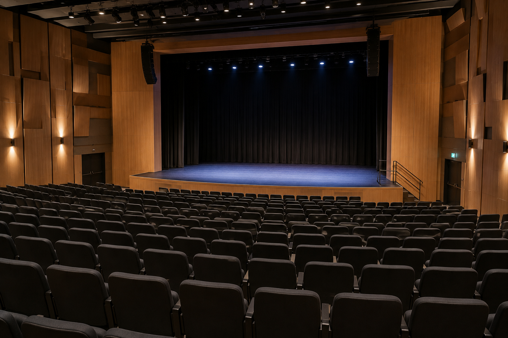

# שקף 52

**תבנית:** לא צוין

## הנחיות הפקה (מתוך הערות השקף)

- תמונה ועליה טקסט
- תמונה בתיקיית אלמנטים

## תוכן השקף

- עליכם לעזור לצוות בשטח לקבל החלטות מבוססות נתונים על סמך המפות וכלי המדידה.
- באולם יש 400 מושבים סה"כ, והוגדרו 3 סוגי כרטיסים:
- כרטיסים מוזלים לתלמידי בית הספר
- כרטיסים במחיר מלא להורים ולאורחים
- כרטיסי נגנים, זמרים ואנשי צוות - ללא עלות
- המשך

## תמונות רפרנס

