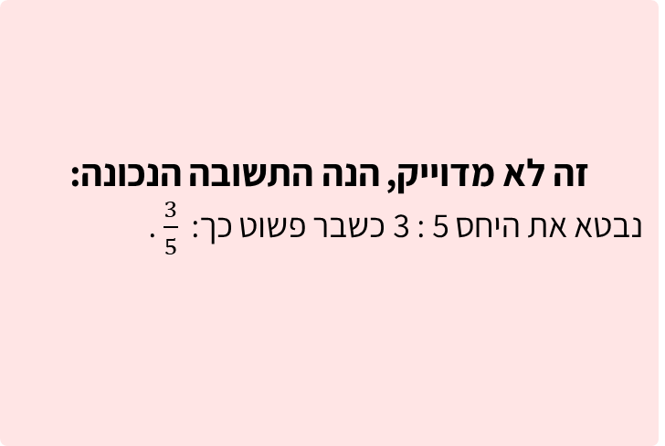
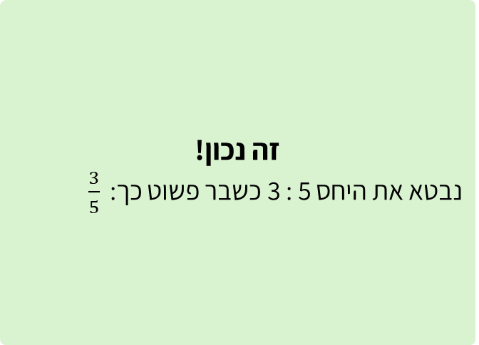

# שקף 53

**תבנית:** ValueInputQuestion

## הנחיות הפקה (מתוך הערות השקף)

- שאלת שיא סעיף א.1 מתוך 6 סעיפים
- שם המסך בפיגמה:ValueInputQuestion
- תמונה בתיקיית תמונות
- אין רמז

## תוכן השקף

- צדקתי?
- חזרה
- א. כדי לאפשר לכמה שיותר תלמידים לקנות כרטיסים במחיר נוח, נקבע שהיחס בין מספר הכרטיסים המוזלים לבין סך כל הכרטיסים יהיה 5 : 3 . (שימו לב, בשאלה זו אין רמז).
- 1. רשמו את היחס כשבר פשוט:
- רמז
- חזרה לשאלה

## תמונות רפרנס

