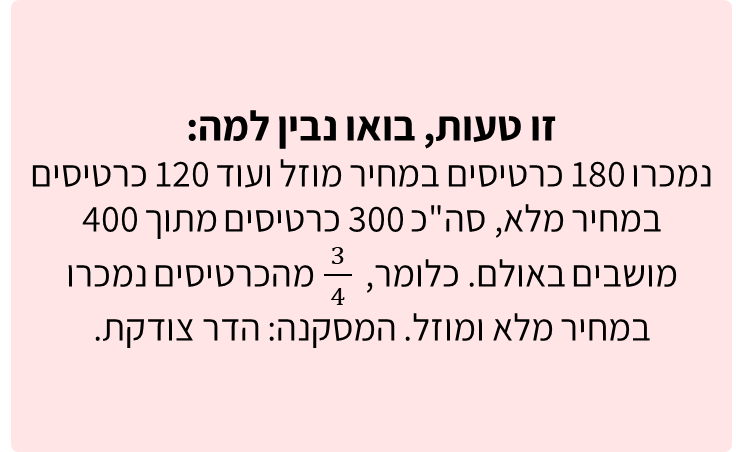
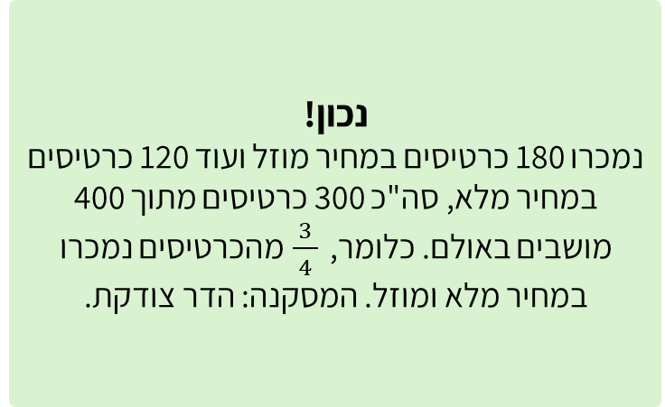

# שקף 60

**תבנית:** SingleChoiceQuestionImage

## הנחיות הפקה (מתוך הערות השקף)

- שאלת שיא סעיף ה מתוך 6 סעיפים
- שם המסך בפיגמה:SingleChoiceQuestionImage

## תוכן השקף

- ה. בשלב הראשון, התלמידים רצו לחשב כמה כרטיסים נמכרו במחיר מלא ומוזל, מתוך כלל הכרטיסים.
- הדר טענה שהכרטיסים שנמכרו במחיר מלא ומוזל מהווים יחד   מכלל המושבים באולם.
- האם היא צודקת?
- צדקתי?
- אפשר רמז?
- חזרה
- רמז: כמה כרטיסים נמכרו בסך הכל?
- חזרה לשאלה
- כן
- לא
- אי אפשר לדעת
- נכון!
- נמכרו 180 כרטיסים במחיר מוזל ועוד 120 כרטיסים במחיר מלא, סה"כ 300 כרטיסים מתוך 400 מושבים באולם. כלומר,  מהכרטיסים נמכרו במחיר מלא ומוזל. המסקנה: הדר צודקת.
- זו טעות, בואו נבין למה:
- נמכרו 180 כרטיסים במחיר מוזל ועוד 120 כרטיסים במחיר מלא, סה"כ 300 כרטיסים מתוך 400 מושבים באולם. כלומר,  מהכרטיסים נמכרו במחיר מלא ומוזל. המסקנה: הדר צודקת.

## תמונות רפרנס

